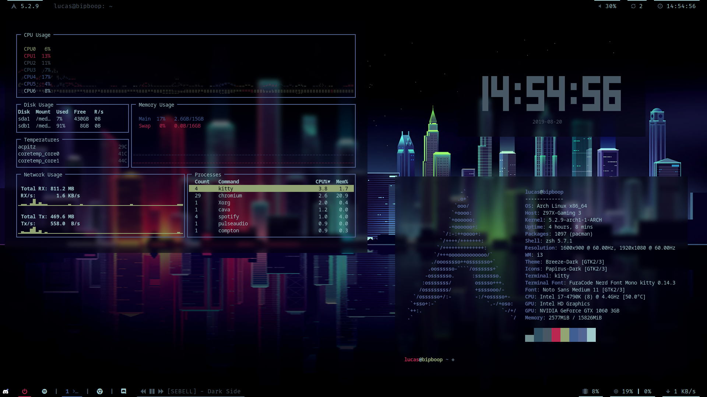

# Dotfiles
My config files, feel free to use them as you want.

Not that some config like grub/cura are just here to help me maintain my configs.

## Screenshot

## Dependencies
Packages names from the official [Official Archlinux repository](https://www.archlinux.org/packages/) and the [AUR](https://aur.archlinux.org/packages/).

The dependencies between each config are expressed below (read the i3 config can't work properly
without polybar installed).

* [python-pywal](https://github.com/dylanaraps/pywal)
	* [i3-gaps](https://github.com/Airblader/i3/)
		* [polybar](https://github.com/jaagr/polybar/)
		* [compton-tryone-git (kawase blur)](https://github.com/yshui/compton/)
		* [rofi-git > 1.5.4 (branch next at the time)](https://github.com/DaveDavenport/rofi/)
		* [kitty](https://github.com/kovidgoyal/kitty)
	* [betterlockscreen-git](https://github.com/pavanjadhaw/betterlockscreen)
	* [dunst](https://github.com/dunst-project/dunst)
* [lightdm](https://github.com/CanonicalLtd/lightdm/)
	* [lightdm-webkit-theme-aether](https://github.com/NoiSek/Aether)
* [zsh](https://github.com/zsh-users/zsh)
	* [oh-my-zsh-git](https://github.com/robbyrussell/oh-my-zsh)
	* [spaceship-prompt-git](https://github.com/denysdovhan/spaceship-prompt)
* [ranger](https://github.com/ranger/ranger)
